# Aurora MarvinS

Aurora MarvinS is an unofficial continuation and modification of the original **Aurora Marvin** project, updated for **Aurora 4X C# 2.7.1** with new features and changes.

## About

This version was updated by **Sanek**. It builds on the original Aurora Marvin project and adds updated charting, visualization, customization and Tech Tree functionality while retaining the original project's purpose of reading and presenting Aurora data.

The original author, **Scnaeg**, has given permission for the project to be continued and published as a free and open-source project and agreed to the plan to publish Aurora MarvinS under the GNU GPL v3.0.

## Latest Release

The latest stable release is **Aurora MarvinS v1.0.0**.

See the [Releases](../../releases) page to download the latest version.

## Original project

Aurora Marvin was originally created by **Scnaeg**.

Original repository:

https://gitlab.com/Scnaeg/auroramarvin

## Tech Tree inspiration

The redesigned Tech Tree layout implementation is inspired by the layout shared in:

https://www.reddit.com/r/aurora/comments/1vrzho8/complete_tech_tree_for_aurora_271/

The Tech Tree implementation in Aurora MarvinS is an independent implementation and is intended to provide an easier-to-read visualization of Aurora research dependencies.

## Current features

- Aurora 4X C# 2.7.1 compatibility
- Resource and population charts
- Relative and Game Time chart axes
- Historical chart ranges
- Mineral selection and comparison
- Trend visualization
- Moving-average and baseline overlays
- Chart zoom, panning and reset
- PNG and CSV export where supported
- Chart event markers
- Light and Dark themes
- Customizable resource colors
- Year 1 chart/date support
- Redesigned color-coded Tech Tree
- Research status indicators for researched and currently researched technologies
- Tech Tree research-status filtering
- Cross-field Tech Tree dependencies
- Automatic filtering of system/start technologies, BioEnergy and Swarm technologies from the displayed Tech Tree

## Screenshots

### Overview

The Overview tab provides a general view of issues to be fixed and general information useful for players.

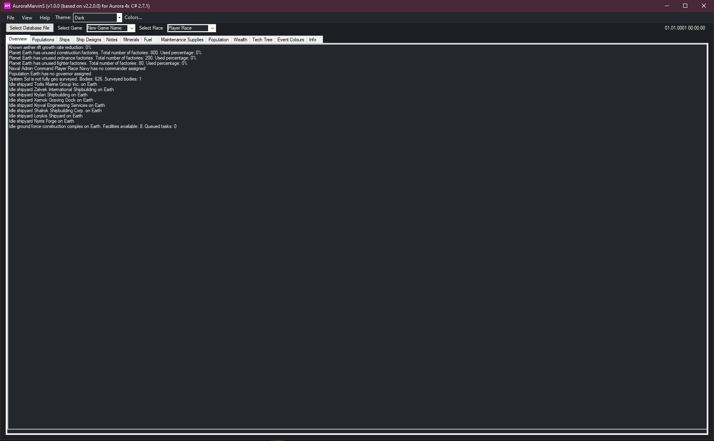

### Charts

#### Fuel

The Fuel chart shows fuel-related data over time, allowing the player to track changes throughout the campaign.

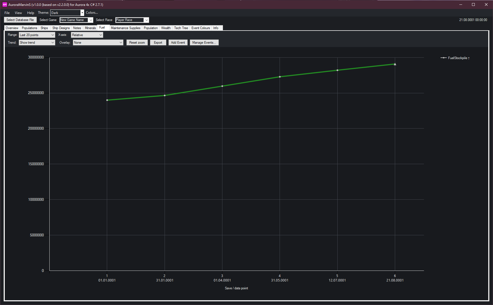

#### Maintenance

The Maintenance chart visualizes maintenance-related data recorded from the Aurora database.

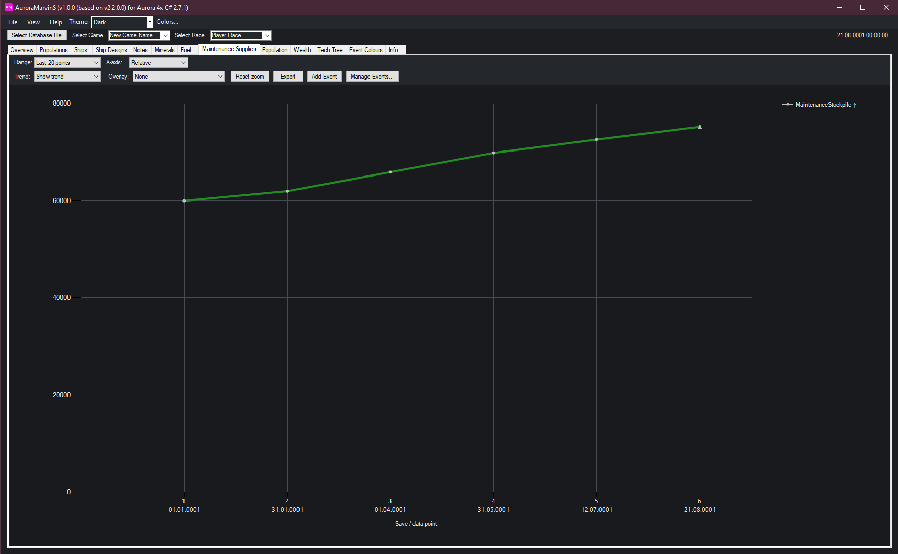

#### Population

The Population chart displays population data over the recorded history of the game.

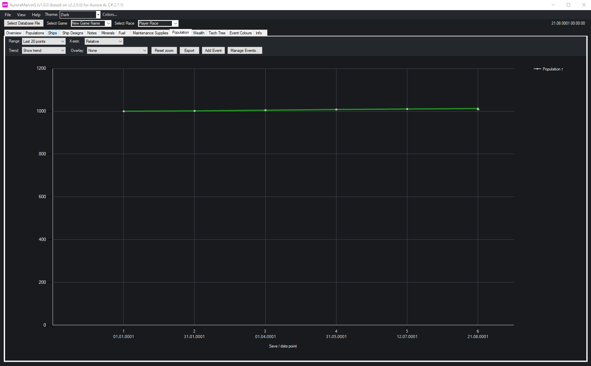

#### Wealth

The Wealth chart visualizes wealth-related data over time.

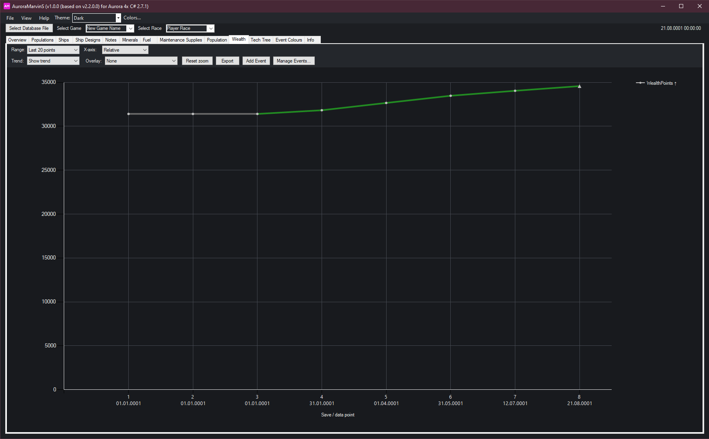

### Minerals

#### Mineral Overview

The Mineral Overview shows the available mineral data and their values across the recorded game history.

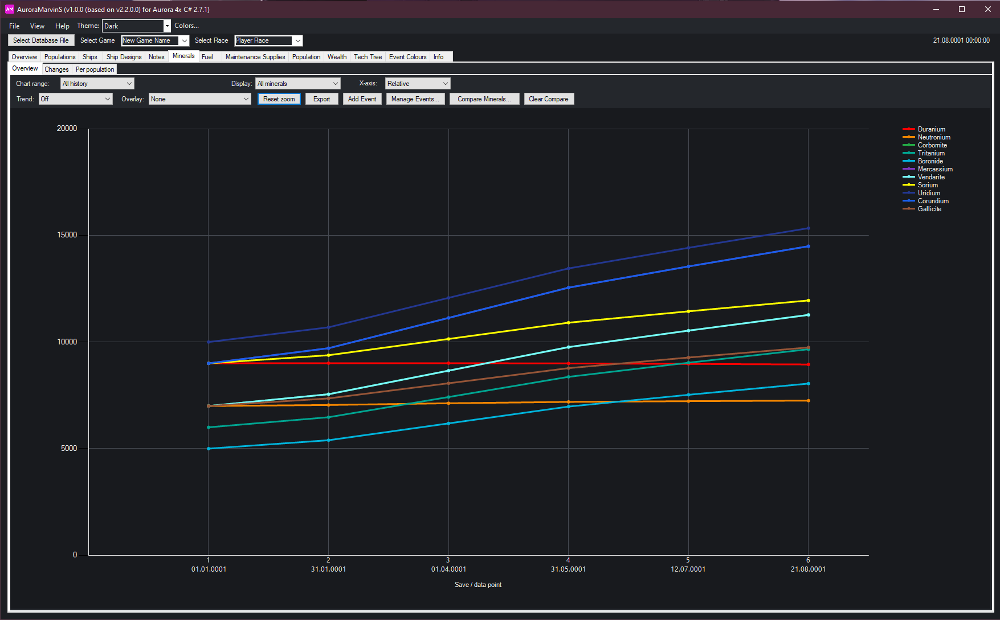

#### Mineral Trends

The Mineral Trends view helps visualize whether selected mineral quantities are increasing or decreasing over time.

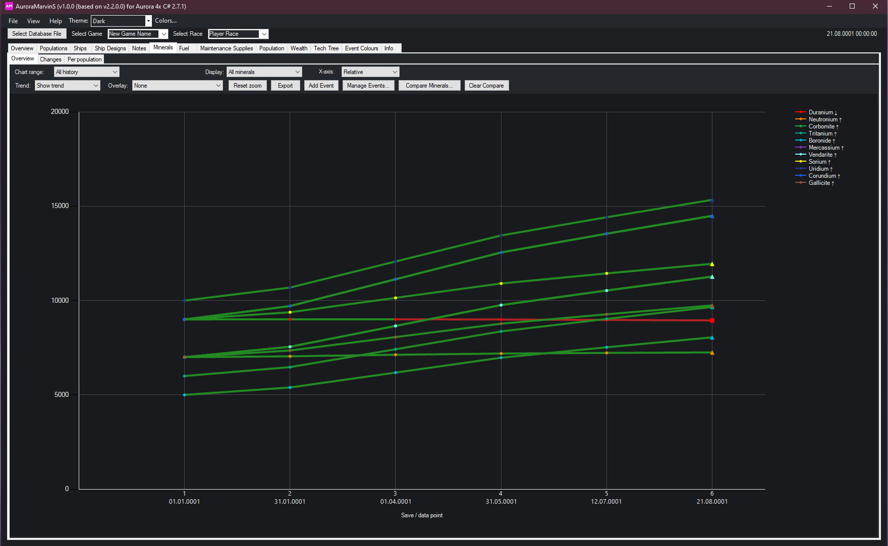

#### Custom Mineral Colors

This screenshot demonstrates multiple mineral chart features used together, including mineral comparison, trend visualization and linear projection.

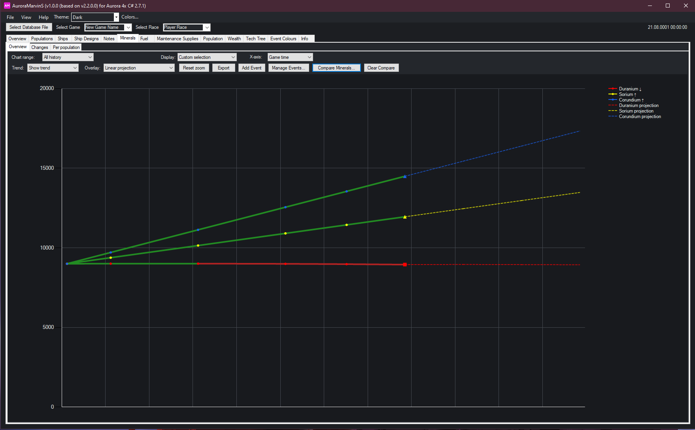

### Tech Tree

#### Complete Tech Tree

The redesigned Tech Tree organizes technologies and their dependencies from left to right, with color-coded connections between technologies and support for dependencies across different technology fields.

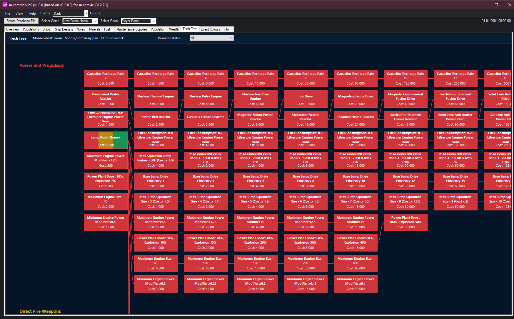

#### Currently Researched Technologies

This view highlights the technologies that are currently being researched by the player.

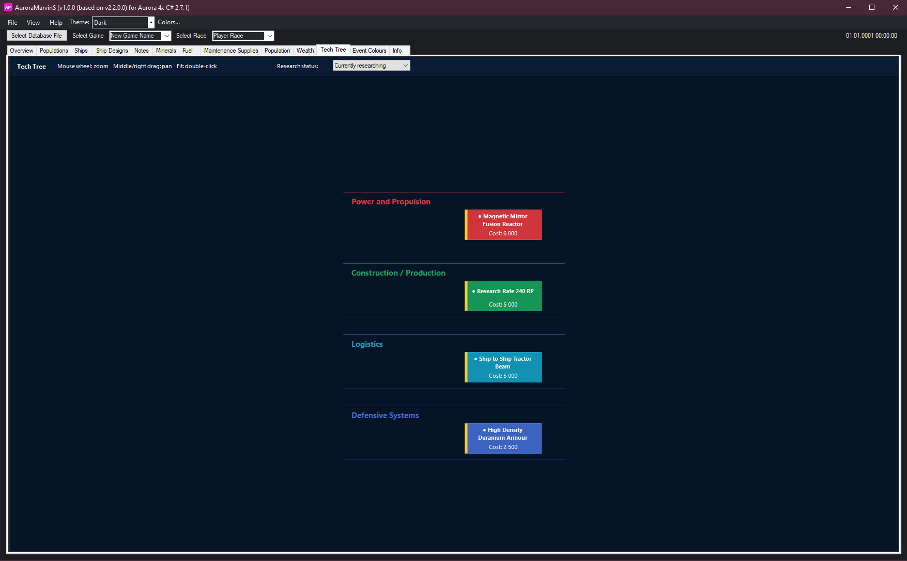

#### Unlocked Technologies

This view filters the Tech Tree to show technologies that have been unlocked, making it easier to see the technologies currently available to the player.

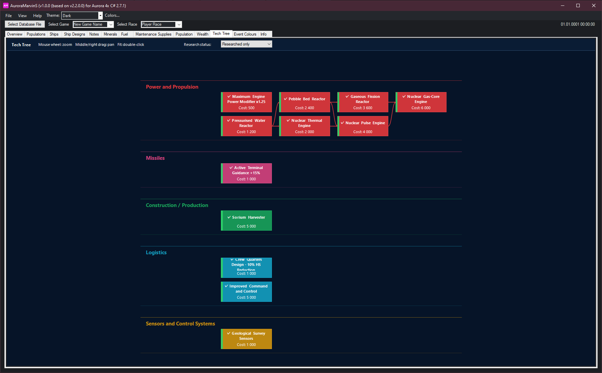

## Building

Aurora MarvinS is a C#/.NET Framework project intended to be built with Visual Studio 2022.

1. Open `AuroraMarvin.sln` in Visual Studio 2022.
2. Restore any required NuGet packages/references if Visual Studio prompts you to do so.
3. Select the `Release` configuration.
4. Build or rebuild the solution.

## Important

The Tech Tree filters and visualization changes affect only what Aurora MarvinS displays. They do **not** remove or modify those technologies in the Aurora database.

Aurora MarvinS is an unofficial project/modification and is not affiliated with the official Aurora 4X application. Please do not report Aurora MarvinS bugs to the official Aurora 4X developer.

## Credits

See [CREDITS.md](CREDITS.md). Project lineage and permission context are summarized in [PROJECT_HISTORY.md](PROJECT_HISTORY.md).

## License

Aurora MarvinS is released under the **GNU General Public License v3.0 (GPL-3.0)**. See [LICENSE](LICENSE) for the full license text.

The original Aurora Marvin project was created by Scnaeg. Permission was obtained from the original author to continue and publish the project as free and open source, including the plan to publish Aurora MarvinS under GPL-3.0. The original project is credited in [CREDITS.md](CREDITS.md).

## AI assistance

ChatGPT was used to assist with the development, implementation and refinement of features in Aurora MarvinS. AI assistance is disclosed here and in the application's Info section.
